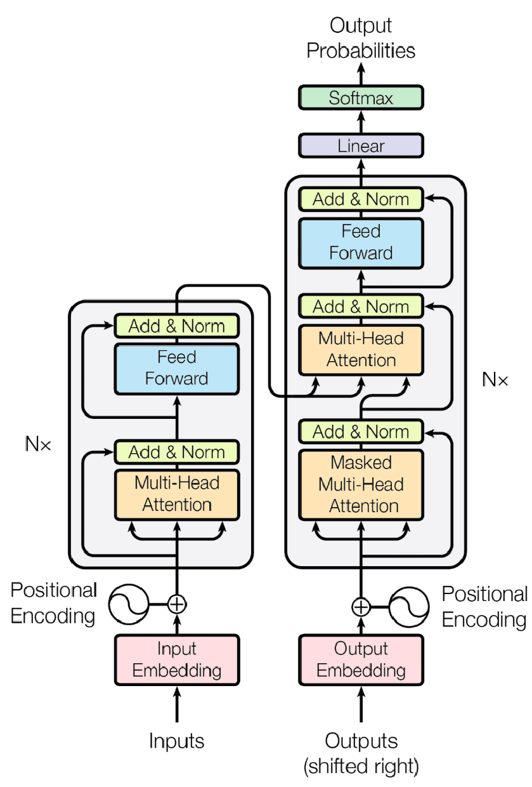

# Build LLM From Scratch

## Overview 

Inspired by Sebastian Raschka's book, "Build a Large Language Model (From Scratch)," this repository offers a practical demonstration of LLM building from the ground up. It covers key aspects of the Transformer architecture, and the intricacies involved in building and training your own LLMs. 

 
## Prerequisite 
Basic knowledge of Python, Machine Learning, Neural Networks and Large Language Models 

## Transformer Architecture 
 

 

## Code Walkthrough 
1. a_tokenizer.py - To understand basics of tokenizer. A tokenizer is a component that splits text into smaller units (tokens). It downloads file "the-verdict.txt" to read all the words from the file and prepare vocabulary. Shows how to create tokens from simple sentences and large texts(vocabulary) by using delimiter characters like space etc. 

2. b_tokenizer.py - Implements simple tokenizer class SimpleTokenizerV1 with two methods encode and decode. Method “encode” to split words of the text into tokens and return token-ids(numbers). Method “decode” converts list of token-ids(numbers) into original text. 

3. c_tokenizer.py - Implements tokenizer SimpleTokenizerV2. This tokenizer is little more capable than SimpleTokenizerV1. It handles two extra tokens "<|unk|>" for the words missing from the vocabulary and "<|endoftext|>" as a separator between sentences. 

4. d_tokenizer.py - In this file we will use tiktoken to create refined tokenizer. You can experience how this tokenizer is more advanced compared to SimpleTokenizerV1 and SimpleTokenizerV2 we created before. 

5. e_data_prepration.py - Implements GPTDatasetV1 to accept text to be used to create dataset, tokenizer, max length for chunks. Then creates dataset of list of input and target tensors of chunks. 

6. f_embeddings.py - This file has a quick walkthrough of creating embeddings from a one simple vector data using Pytorch. 

7. g_embeddings.py - Creates dataset by reading "the-verdict.txt" file using create_dataloader_v1 we created in e_data_prepration.py file. Then creates token embeddings and position embeddings. 

8. gpt_download.py - This file will be downloaded as part of execution of code in the latter files. Please ignore this file for now. 

9. h_self_attention.py - First we define PyTorch tensor (matrix) representing 6 input elements (rows), each having a 3-dimensional feature vector. These rows represent word embeddings for each word. Take second element as a "query". Then calculates attention score, attention weights and context vectors step by step. 

10. i_compact_self_attention.py - This file implements simple self-attention using Pytorch. 

11. j_linear_self_attention.py - This file implements self-attention using linear layers. Then performs following steps - a) calculates attention weights b) apply masking c) apply normalization d) apply negative infinity masking e) calculates attention weights again f) apply dropout. 

12. k_casual_self_attention.py - Implements CausalAttention. Various steps a-f we performed in j_linear_self_attention.py are accommodated in the self-attention class itself by using Pytorch classes. 

13. l_multi_head_attention.py - In this file we will implement class MultiHeadAttentionWrapper. We are going to define number for num_heads and then iterate through loop to add CausalAttention instance in the ModuleList. Essentially MultiHeadAttentionWrapper is the list of CausalAttention based on num_heads value. 

14. m_efficient_multi_head_attention.py - Lets implement efficient multi-head attention class MultiHeadAttention. 

15. n_dummy_gpt_model.py - In this class we will implement DummyGPTModel. This is basic skeleton of GPT model. 

16. o_use_dummy_gpt_model.py - Time to initialize DummyGPTModel we created in n_dummy_gpt_model.py file. Then we will get output calling this model for simple inputs. 

17. p_layernorm_gelu_feedforward.py - This is to implement and understand classed LayerNorm, GELU, FeedForward. 

18. q_shortcut_dnn.py - We will implement ExampleDeepNeuralNetwork in this file to understand simple deep neural network. Neural Network is important building block of Transformer architecture. 

19. r_transformer_block.py - Now we will implement TransformerBlock class using MultiHeadAttention we created in m_efficient_multi_head_attention.py, FeedForward, LayerNorm we defined in p_layernorm_gelu_feedforward.py and Dropout. 

20. s_gpt_model.py - Time to implement GPTModel properly.  

21. t_gpt_model_pretraining.py - This is to pre-trained our GPTModel model with very basic data, couple of inputs and targets example. This should give you basic idea about large language model pretraining. 

22. u_gpt_model_pretraining_using_data.py - In this file we will pretrain GPTModel with some proper data created using text from the "the-verdict.txt" file. 

23. v_load_gpt2_model_weights.py - Real magic is in this file. We will download weights of GPT2 model and load into our GPTModel. You can choose from following model sizes and play around based on how much GPU power you have. a) "gpt2-small (124M)" b) gpt2-medium (355M) c) gpt2-large (774M) d) gpt2-xl (1558M) 

24. w_model_finetune_classifier.py - In this file we will fine-tune our GPTModel model to be used for classification like spam/not-spam use case. 

25. x_finetune_model_instructions.py - Now we will fine-tune our GPTModel with instructions data to make it instruct model. Idea is to train our model so it would follow user instructions. 

26. y_neural_network_back_to_basics.py - Time to go back to basics and revise basics neural networks. 

27. z_gpt_model_lora_finetuned.py - This is my most favorite part. We will finetune our model using Low Rank Adaptation(lora) technique. LoRA (Low-Rank Adaptation) fine-tuning is a parameter-efficient technique that freezes the original LLM weights and introduces a small number of trainable rank-decomposition matrices to adapt the model to a specific task, significantly reducing training costs.